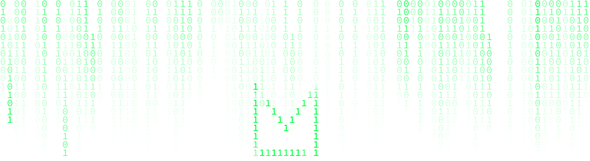
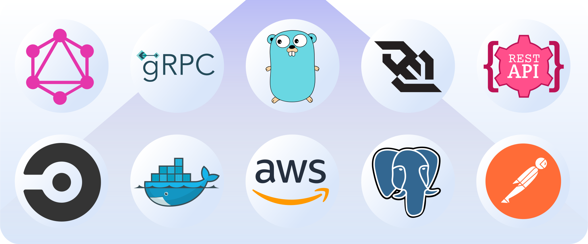

<div align="center">

</div>

<br>


I'm Lukas, but my nickname is simply Luke. I have a background in C and Java and currently i am a software engineer mainly working with Go developing microservice architecture. I am a purist when it comes to code, I enjoy writing code from scratch, crafting elegant solutions that stand the test of time (🤪).
In my free time, I'm all about exploring the fascinating world of low-level programming. There's something magical about diving into the nitty-gritty details of bits and bytes, and seeing a raw output on the terminal screen always gets me as excited as a 5-year-old on a water slide for the first time 🤩 (*It has to be a 5 year old that actually likes water and adrenalin rushs, you get my point...*)! Furthermore you can find me geeking out over typography, tinkering with computer hardware, or simply embracing the cozy familiarity of my beloved terminal ❤️.

When I'm not immersed in the world of programming, you can find me engaging in lively conversations, diving into captivating books, exploring the great outdoors through hiking, and savoring delicious food.

Feel free to explore my repositories and join me on this exciting coding journey. Let's create remarkable software together! 🚀

<br>

<div align="center">
<h1>Main Tech Stack</h1>
<div>

</div>

<details>
<summary>Check out the complete toolbox 🧰 (click me 👻)</summary>
<table>
<tr>
<td>Languages</td>
</tr>
<tr>
<td>
<a href="https://en.wikipedia.org/wiki/C_(programming_language)" title="C"></a>
<a href="https://www.gnu.org/software/bash/" title="Bash"></a>
<a href="https://www.java.com/" title="Java"></a>
<a href="https://www.ruby-lang.org/" title="Ruby"></a>
<a href="https://developer.mozilla.org/en-US/docs/Web/JavaScript" title="JavaScript"></a>
<a href="https://golang.org/" title="Go"></a>
<a href="https://www.lua.org/" title="Lua"></a>
<a href="https://ziglang.org" title="Zig"></a>
<a href="https://www.w3.org/TR/html5/" title="HTML5"></a>
<a href="https://www.w3.org/TR/CSS/" title="CSS3"></a>
<a href="https://sass-lang.com/" title="Sass"></a>
<a href="https://daringfireball.net/projects/markdown/" title="Markdown"></a>
</td>
</tr>
  
<tr>
<td>AWS</td>
</tr>
<tr>
<td>
<a href="https://aws.amazon.com/s3/" title="AWS S3"></a>
<a href="https://aws.amazon.com/dynamodb/" title="AWS DynamoDB"></a>
<a href="https://aws.amazon.com/rds/" title="AWS RDS"></a>
<a href="https://aws.amazon.com/sns/" title="AWS SNS"></a>
<a href="https://aws.amazon.com/sqs/" title="AWS SQS"></a>
<a href="https://aws.amazon.com/lambda/" title="AWS Lambda"></a>
<a href="https://aws.amazon.com/cloudwatch/" title="AWS CloudWatch"></a>
</td>
</tr>

<tr>
<td>Database</td>
</tr>
<tr>
<td>
<a href="https://www.postgresql.org/" title="PostgreSQL"></a>
<a href="https://dev.mysql.com/" title="MySQL"></a>
<a href="https://www.sqlite.org/" title="SQLite"></a>
</td>
</tr>

<tr>
<td>Communication</td>
</tr>
<tr>
<td>
<a href="https://www.w3.org/2001/sw/wiki/REST" title="Rest"></a>
<a href="https://graphql.org/" title="GraphQL"></a>
<a href="https://www.w3.org/TR/websockets/" title="WebSocket"></a>
</td>
</tr>

<tr>
<td>UI/UX</td>
</tr>
<tr>
<td>
<a href="https://www.figma.com/" title="Figma"></a>
<a href="https://trello.com/" title="Trello"></a>
</td>
</tr>

<tr>
<td>General tools</td>
</tr>
<tr>
<td>
<a href="https://git-scm.com/" title="Git"></a>
<a href="https://circleci.com/" title="CircleCI"></a>
<a href="https://reactjs.org/" title="React"></a>
<a href="https://prettier.io/" title="Prettier"></a>
<a href="https://curl.se/" title="Curl"></a>
<a href="https://www.getpostman.com/" title="Postman"></a>
<a href="https://gitup.co/" title="GitUp"></a>
<a href="https://www.docker.com/" title="docker"></a>
</td>
</tr>
</table>
</details>

<a href="https://github.com/lmllrjr">

</a>

</div>

<br>

```sh

    __  __                                                   __         __            __
   / / / /___ __   _____     ____ _   ____ _________  ____ _/ /_   ____/ /___ ___  __/ /
  / /_/ / __ `/ | / / _ \   / __ `/  / __ `/ ___/ _ \/ __ `/ __/  / __  / __ `/ / / / / 
 / __  / /_/ /| |/ /  __/  / /_/ /  / /_/ / /  /  __/ /_/ / /_   / /_/ / /_/ / /_/ /_/  
/_/ /_/\__,_/ |___/\___/   \__,_/   \__, /_/   \___/\__,_/\__/   \__,_/\__,_/\__, (_)   
                                   /____/                                   /____/                
```
